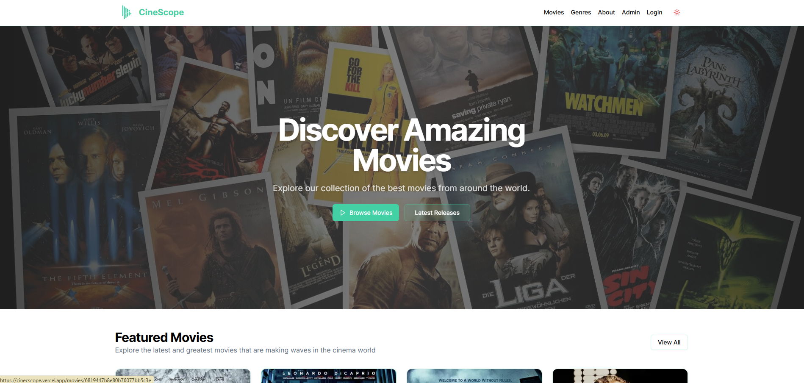
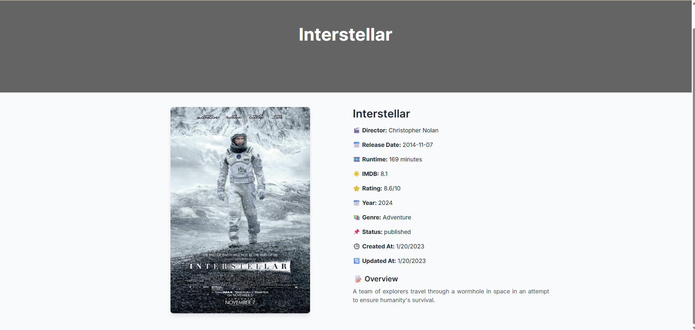
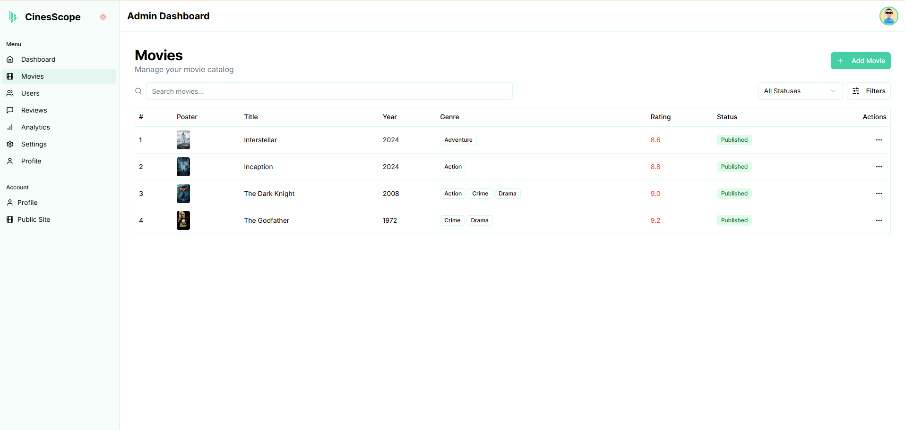

# 🎬 Cinecscope

A modern movie discovery and rating web app built with **Next.js 14**, **App Router**, **ShadCN UI**, **Tailwind CSS**, and **MongoDB**.

🌐 **Live Demo**: [https://cinecscope.vercel.app](https://cinecscope.vercel.app)  
📦 **GitHub Repo**: [github.com/Ravindu200232/cinecscope](https://github.com/Ravindu200232/cinecscope)

---

## ✨ Features

- 🔍 Search and filter movies by title, genre, director, etc.
- 🎞️ Detailed movie pages with poster, rating, genre, and overview
- 🗂️ Admin interface to manage movies
- 📈 Server-side rendering and dynamic routes
- 💡 Beautiful UI using ShadCN components & TailwindCSS
- 📦 MongoDB-based data fetching and search

---

## 📸 Screenshots

> Screenshots are loaded from the `public/` folder.

### 🏠 Home Page


### 🎥 Movie Details Page


### 🧑‍💼 Admin Panel


---

## 🧰 Tech Stack

- **Framework**: [Next.js 14](https://nextjs.org/)
- **UI Components**: [ShadCN UI](https://ui.shadcn.com/)
- **Styling**: Tailwind CSS
- **Database**: MongoDB
- **Deploy**: Vercel
- **Routing**: Next.js App Router (`app/` directory)

---

## 🚀 Getting Started Locally

```bash
# 1. Clone the repo
git clone https://github.com/Ravindu200232/cinecscope.git
cd cinecscope

# 2. Install dependencies
npm install

# 3. Set up environment variables
cp .env.example .env.local
# Fill in .env.local with your MongoDB and any API keys

# 4. Run the dev server
npm run dev

# Open http://localhost:3000 in your browser


/app
  ├── page.tsx          # Root page
  ├── movie/            # Dynamic movie routes
  ├── admin/            # Admin panel
/components
  ├── ui/               # ShadCN components
  ├── home/             # MovieCard, MovieGrid, etc.
  └── admin/            # MovieTable, filters
/actions                # Server actions for fetching/search
/lib
  ├── db.ts             # MongoDB connection
  └── utils.ts
/public
  ├── 1.png             # Home screenshot
  ├── 2.png             # Movie detail screenshot
  └── 3.png             # Admin screenshot

---

💻 Author
Ravindu Bandara
📧 LinkedIn

---


